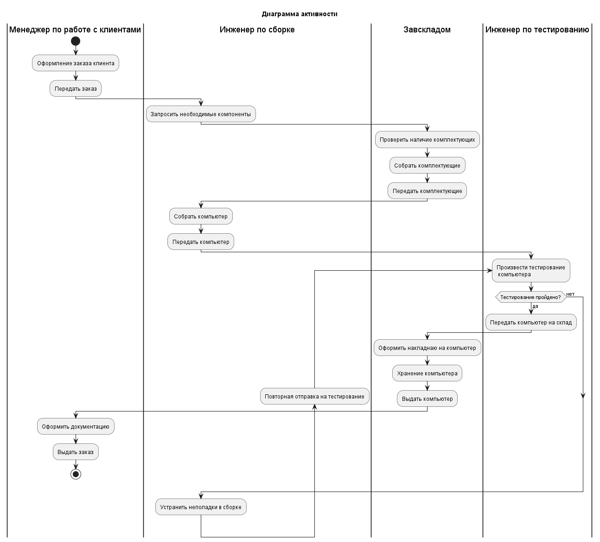

# Практика по UML

## Лабораторная работа 1. Создание диаграммы вариантов использования (диаграммы прецедентов)

### Задание:
- Выделить действующих лиц и прецеденты. 
- Создать диаграмму вариантов использования, в которой будут заданы прецеденты и действующие лица.  
- Вставить отношения между вариантами использования и действующими лицами

**Вариант 3. «Предприятие по сборке и продаже компьютеров».**

### Действующие лица:

- Менеджер по работе с клиентами – сотрудник, который работает с заказчиком и его заказом. 
- Менеджер по снабжению – сотрудник, занимающийся закупкой необходимых комплектующих. 
- Инженер по сборке настольных компьютеров – сотрудник, который занимается сборкой настольных компьютеров. 
- Инженер по сборке ноутбуков – сотрудник, занимающийся сборкой ноутбуков. 
- Инженер по тестированию – сотрудник, который занимается тестированием компьютеров. 
- Завскладом – сотрудник, заведующий складом комплектующих частей.

### Выделим прецеденты:
- Работа с заказом – позволяет менеджеру по работе с клиентами выполнять действия с заказом (добавлять, изменять, удалять). 
- Управление информацией о клиенте – дает возможность менеджеру по работе с клиентами добавлять или удалять клиентов, а также просматривать информацию о них. 
- Управление информацией о поставщиках – позволяет менеджеру по снабжению добавлять или удалять поставщиков. 
- Управление информацией о комплектующих – дает возможность просматривать информацию о комплектующих, производить анализ расходования, делать заказы. 
- Сборка компьютеров – позволяет инженеру по сборке просматривать наряды на сборку компьютеров и отмечать ход выполнения работы. 
- Требование необходимых комплектующих – предназначено для запроса инженером по сборке необходимых запчастей со склада.
- Учет поступления и выдачи комплектующих – позволяет завскладом вести учет поступления и выдачи запчастей со склада.

Для удобства связи «Инженер по сборке настольных компьютеров» и «Инженер по сборке ноутбуков» можно объединить, добавив еще одно действующее лицо – «Инженер по сборке».

**Диаграмма:**


**Код**:


## Лабораторная работа 2. Создание диаграммы классов.

### Задание: 

Создать диаграмму классов для определенного прецедента из лабораторной работы №1, задав атрибуты и операции класса.

Первым создаваемым классом будет класс «Клиент», в котором будут содержаться следующие атрибуты: 
- ИМЯ (ФИО клиента); 
- АДРЕС (адрес клиента); 
- ТЕЛЕФОН (номер телефона клиента);

Операции:

- ДОБАВИТЬ КЛИЕНТА; 
- УДАЛИТЬ КЛИЕНТА; 
- ПОЛУЧИТЬ ИНФОРМАЦИЮ. 

Класс «Заказ». 

Атрибуты: 

- НОМЕР ЗАКАЗА; 
- ДАТА ОФОРМЛЕНИЯ; 
- ДАТА ВЫПОЛНЕНИЯ.

Операции:

- СОЗДАНИЕ НОВОГО ЗАКАЗА;
- ЗАНЕСТИ ИНФОРМАЦИЮ; 
- ПОЛУЧИТЬ ИНФОРМАЦИЮ. 

Класс «Комплектующее изделие». 

Атрибуты: 

- НАИМЕНОВАНИЕ; 
- ПРОИЗВОДИТЕЛЬ; 
- ЦЕНА; 
- ОПИСАНИЕ.

Операции: 

- ДОБАВИТЬ НОВОЕ КОМПЛЕКТУЮЩЕЕ; 
- УДАЛИТЬ КОМПЛЕКТУЮЩЕЕ; 
- ПОЛУЧИТЬ ИНФОРМАЦИЮ (о комплектующем). 

Класс «Состав заказа». 

Атрибуты: 

- НОМЕР ПУНКТА ЗАКАЗА; 
- КОЛИЧЕСТВО КОМПЛЕКТУЮЩИХ; 
- ЦЕНА.

Операции:

- СОЗДАТЬ СТРОКУ ЗАКАЗА; 
- ДОБАВИТЬ ИНФОРМАЦИЮ (о строке); 
- ПОЛУЧИТЬ ИНФОРМАЦИЮ (о строке).

**Диаграмма**:


**Код**:

```plantuml
@startuml class_lab2
title "Диаграмма классов"
left to right direction
allowmixing

class "Client" {
    fio
    address
    phoneNum
    addClient()
    deleteClient()
    getInfo()
}

class "Product" {
    productName
    manufacturer
    price
    description
    addNewProduct()
    deleteProduct()
    getProductInfo()
}

package "OrderPack" {
    class "Order" {
        orderNum
        orderDate
        orderCompleteDate
        newOrderCreate()
        addOrderInfo()
        getOrderInfo()
    }

    class "OrderStructure" {
        pvzNum
        productCount
        orderPrice
        createOrderRow()
        addRowInfo()
        getRowInfo()
    }
    
    boundary "workingOrderParams"
    boundary "addNewOrder"
    control "orderManager"
}

Client "1" -- "1..*" Order : оформляет
OrderStructure "1..*" --* "1" Order: входит в
Product "1" --o "1..*" OrderStructure
addNewOrder "1" --o "1" workingOrderParams

addNewOrder "1" --> "1"  orderManager
orderManager "1" --> "1..*" Order
@enduml
```

## Лабораторная работа 3. Создание диаграммы деятельности.

### Шаг 1. Построение диаграммы деятельности для бизнес-процесса предприятия.
### Задание:

-  Построить диаграмму деятельности, которая описывает один из бизнес-процессов предметной области. 
-  Построить диаграмму деятельности, которая описывает поток событий определенного варианта использования из лабораторной работы №1.

1. После оформления заказа на сборку компьютера, менеджер по работе с клиентами передает заказ инженеру по сборке. 
2. Инженер по сборке, перед началом работы, запрашивает все необходимые компоненты со склада. 
3. Завскладом проверяет наличие комплектующих, собирает и передает инженеру по сборке. 
4. Инженер по сборке производит сборку компьютера и передает его инженеру по тестированию. 
5. Инженер по тестированию тестирует компьютер: 
	- тестирование пройдено – компьютер передается на склад, завскладом оформляет и хранит его до выдачи; 
	- тестирование не пройдено – компьютер передается на повторную сборку и устранение неполадок.
6. Завскладом, по запросу менеджера по работе с заказом, передает компьютер на выдачу. 
7. Менеджер по работе с клиентами оформляет необходимую документацию и выдает клиенту выполненный заказ.

**Диаграмма**:



**Код** :

```plantuml
@startuml activity_lab3_1
title "Диаграмма активности"

|Менеджер по работе с клиентами|
start
:Оформление заказа клиента;
:Передать заказ;

|Инженер по сборке|
:Запросить необходимые компоненты;

|Завскладом|
:Проверить наличие комплектующих;
:Собрать комплектующие;
:Передать комплектующие;

|Инженер по сборке|
:Собрать компьютер;
:Передать компьютер;

|Инженер по тестированию|
repeat :Произвести тестирование\n компьютера;
    if(Тестирование пройдено?) then (да)
        :Передать компьютер на склад;
        
        |Завскладом|
        :Оформить накладнаю на компьютер;
        :Хранение компьютера;
        :Выдать компьютер;

        |Менеджер по работе с клиентами|
        :Оформить документацию;
        :Выдать заказ;
        stop
    else (нет)
    endif
    
|Инженер по сборке|
:Устранить неполадки в сборке;
backward :Повторная отправка на тестирование;
@enduml
```

### Шаг 2. Построение диаграммы деятельности потока событий прецедента «Работа с заказом».

Поток событий прецедента «Работа с заказом» состоит из главных, альтернативных потоков, а также под-потоков. Для удобства, схему можно разделить на две части. Первая часть будет содержать общую диаграмму потока, а вторая – схему для определенного действия (под-потока), в данном случае это будет «Добавить заказ». 

Для построения первой схемы, необходимо определить, какие действия будут входить нее. 
1. Менеджер по работе с клиентами входит в систему, вводит логин и пароль. 
2. Система проверяет правильность введенных данных: 
	- данные введены верно – переход к следующему шагу; 
	- данные введены неверно – переход к вводу данных. 
3. Менеджер выбирает действие, которое нужно произвести с заказом: 
	- добавить заказ; 
	- изменить заказ; 
	- просмотреть заказ; 
	- удалить заказ. 
4. После произведенных операций, менеджер выходит из системы или же заново выбирает действие. 

После ввода данных следует поставить конечный узел, поскольку менеджер должен иметь возможность выйти из системы если, например, он забыл логин и пароль для входа в систему.


Теперь нужно построить схему под-процесса «Добавить заказ».

Определение действий, входящих в диаграмму под-процесса «Добавить заказ»: 
1. Выбор типа компьютера (настольный ПК/ноутбук). 
2. Выбор клиента из базы. 
3. Выбор комплектующих: 
	- если не все комплектующие – переход к выбору; 
	- если комплектующих нет – переход к выбору и выход; 
	- если все комплектующие выбраны – запись введенных менеджером данных.

**Диаграмма**:


**Код:**

```plantuml
@startuml activity_lab3_2
title "Диаграмма деятельности потока событий прецедента "Работа с заказом""

start
repeat
    if (Вы забыли логин или пароль?) then (да)
        :Выйти из системы;
        stop
    else (нет)
        :Ввести логин и пароль;
    endif
    
repeat while (Данные введены корректно?) is (нет) not (да)

repeat :Выбор действия;
    switch ()
        case ()
            partition "Процесс добавления заказа" {
                :Добавить заказ;
                switch (Выбрать тип компьютера)
                    case ()
                        :Выбрать Настольный ПК;
                    case ()
                        :Выбрать Ноутбук;
                endswitch
                :Выбрать клиента из базы;
                repeat
                    :Выбрать комплектующие;
                    switch ()
                        case ()
                            :Все комплектующие\n выбраны;
                            :Запись введенных\n данных;
                        case ()
                            :Нет всех комплектующих;
                            :Перейти к выбору\n новых комплектующих;
                        case ()
                            :Комплектующих нет;
                    endswitch
                repeat while (Перейти к выбору) is (да) not (нет)
                :Выйти из меню выбора комплектующих;
            }
        case ()
            :Изменить заказ;
        case ()
            :Просмотреть заказ;
        case ()
            :Удалить заказ;
    endswitch
repeat while (Обработать заказ?) is (да) not (нет)
:Выйти из системы;
stop
@enduml
```


## Лабораторная работа 4. Создание диаграммы последовательностей UML.

### Задание:

Создать диаграмму последовательности и кооперации для одного из сценариев любого прецедента из лабораторной работы №1.

Сценарий «Добавить заказ» и прецедент «Работа с заказом». Для наглядности и удобства построения примера выбран один случай развития событий – пользователь корректно ввел все данные, которые в последующем сохранятся в базе данных.


| №   | Участник – отправитель сообщения | Участник – получать сообщения | Название сообщения               |
| --- | -------------------------------- | ----------------------------- | -------------------------------- |
| 1   | Менеджер по работе с клиентами   | Параметры работы с заказом    | Ввод пароля                      |
| 2   | Параметры работы с заказом       | Параметры работы с заказом    | Проверка пароля                  |
| 3   | Менеджер по работе с клиентами   | Параметры работы с заказом    | Выбор операции «Добавить заказ»  |
| 4   | Параметры работы с заказом       | Добавление нового заказа      | Отображение полей ввода          |
| 5   | Менеджер по работе с клиентами   | Добавление нового заказа      | Выбор типа компьютера            |
| 6   | Добавление нового заказа         | Менеджер по работе с заказами | Получение списка клиентов        |
| 7   | Менеджер по работе с заказами    | Клиент                        | Получение списка клиентов        |
| 8   | Клиент                           | Добавление нового заказа      | Список клиентов                  |
| 9   | Добавление нового заказа         | Добавление нового заказа      | Отображение списка клиентов      |
| 10  | Менеджер по работе с клиентами   | Добавление нового заказа      | Выбор клиента                    |
| 11  | Добавление нового заказа         | Менеджер по работе с заказом  | Получение списка комплектующих   |
| 12  | Менеджер по работе с заказом     | Комплектующее изделие         | Получение списка комплектующих   |
| 13  | Комплектующее изделие            | Добавление нового заказа      | Список комплектующих             |
| 14  | Добавление нового заказа         | Добавление нового заказа      | Отображение списка комплектующих |
| 15  | Менеджер по работе с клиентами   | Добавление нового заказа      | Выбор комплектующих              |
| 16  | Менеджер по работе с клиентами   | Добавление нового заказа      | Сохранить заказ                  |
| 17  | Добавление нового заказа         | Менеджер по работе с заказом  | Передача управления              |
| 18  | Менеджер по работе с заказом     | Заказ                         | Сохранение                       |

**Диаграмма**:


**Код**:


